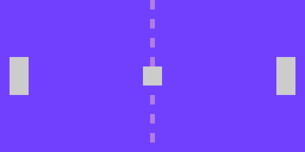

== Finding Your Center

There's really something irking me about the last section. Why is everything so weirdly off-center?

It's simple. A sprite's position on the screen is relative to its top-left corner. So if you have a sprite that is 16x16 pixels, and paste it to (8,8), its center is actually (16,16).

Therefore, if you want to position things correctly on the screen, you have to add code to correct this offset.

=== Instructions

==== Calculating Offsets (Zzz...)

Take this code snippet:

[source, language='pub']
.HelloPong.spin
----
    repeat i from 0 to 7
        gfx.Sprite (@centerline_gfx, 64, i*8, 0)
    
    gfx.Sprite (@ball_gfx, 64, 32, 0)
    gfx.Sprite (@paddle_gfx, 4, 32, 0)
    gfx.Sprite (@paddle_gfx, 124, 32, 0)
----

- The center line is 2 pixels wide, so we should subtract 1 to center it.
+
    x = 64 - 1 = 63
    
- The left paddle should be 4 pixels from the edge, so it's fine where it is.
+
    x = 4
    
- The right paddle is falling off the screen! We want its right side 4 pixels from the edge. Since it's 8 pixels wide, we need to subtract 8.
+
    x = 124 - 8 = 116
    
- Both paddles need to start centered. They're 16 pixels high, so we'll subtract half to center them vertically.
+
    y = 32 - 8 = 24
    
- The ball is 8 pixels wide and tall, and belongs in the center of the screen.
+
    x = 64 - 4 = 60
    y = 32 - 4 = 28

Putting it all together.

[source, language='pub']
.HelloPong.spin
----
    repeat i from 0 to 7
        gfx.Sprite (@centerline_gfx, 63, i*8, 0)
    
    gfx.Sprite (@ball_gfx, 60, 28, 0)
    gfx.Sprite (@paddle_gfx, 4, 24, 0)
    gfx.Sprite (@paddle_gfx, 116, 24, 0)
----

And there you have it, folks! Centered and beautiful.

==== Automating Offset Calculation (Alright!)

Awesome! Everything is looking great, your images are sized correctly and you're ready to go.

Oh, wait, but you just decided the paddle should be 14 pixels long instead of 16.

_Well, that's a problem!_

Do you really want to go back and do all that math again to figure out the spacing? I know I don't, and I'm the one writing the tutorial, so it's my call.

Luckily, you don't _have_ to! The LameStation is a computer, of course, and computers were invented for the express purpose of quickly performing mind-numbing calculations all day long, so you're in good hands.

You see, packed into each sprite is its width and height, and while you could access it directly, the easiest way to get that information is with the `gfx.Width` and `gfx.Height` commands.

The syntax is easy: just pass the address of a sprite to either one and it'll return the value in pixels.

[source]
.HelloPong.spin
----
VAR
    byte    i

PUB Main
    lcd.Start(gfx.Start)
    ctrl.Start

    repeat i from 0 to 7
        gfx.Sprite (@centerline_gfx, 64 - gfx.Width (@centerline_gfx) / 2, i*8, 0)
    
    gfx.Sprite (@ball_gfx, 64 - gfx.Width (@ball_gfx) / 2, 32 - gfx.Height (@ball_gfx) / 2, 0)
    gfx.Sprite (@paddle_gfx, 4, 32 - gfx.Height (@paddle_gfx) / 2, 0)
    gfx.Sprite (@paddle_gfx, 124 - gfx.Width (@paddle_gfx), 32 - gfx.Height (@paddle_gfx) / 2, 0)
    
    lcd.Draw

DAT

    ball_gfx
----

Now, your images should still be centered like before. However, even if you change the sprites to use a larger paddle, smaller ball, or anything else, all of your code will still work.

Now *THAT* is a time-saver.

=== The Code

[source]
.HelloPong.spin
----
CON
    _clkmode = xtal1 + pll16x
    _xinfreq = 5_000_000
    
OBJ
    lcd  : "LameLCD"
    gfx  : "LameGFX"
    ctrl : "LameControl"
    
VAR
    byte    i

PUB Main
    lcd.Start(gfx.Start)
    ctrl.Start

    repeat i from 0 to 7
        gfx.Sprite (@centerline_gfx, 64 - gfx.Width (@centerline_gfx) / 2, i*8, 0)
    
    gfx.Sprite (@ball_gfx, 64 - gfx.Width (@ball_gfx) / 2, 32 - gfx.Height (@ball_gfx) / 2, 0)
    gfx.Sprite (@paddle_gfx, 4, 32 - gfx.Height (@paddle_gfx) / 2, 0)
    gfx.Sprite (@paddle_gfx, 124 - gfx.Width (@paddle_gfx), 32 - gfx.Height (@paddle_gfx) / 2, 0)
    
    lcd.Draw

DAT

    ball_gfx
    word    0
    word    8, 8
    word    %%11111111
    word    %%11111111
    word    %%11111111
    word    %%11111111
    word    %%11111111
    word    %%11111111
    word    %%11111111
    word    %%11111111
    
    paddle_gfx
    word    0
    word    8, 16
    word    %%11111111
    word    %%11111111
    word    %%11111111
    word    %%11111111
    word    %%11111111
    word    %%11111111
    word    %%11111111
    word    %%11111111
    word    %%11111111
    word    %%11111111
    word    %%11111111
    word    %%11111111
    word    %%11111111
    word    %%11111111
    word    %%11111111
    word    %%11111111
    
    centerline_gfx
    word    0
    word    2, 4
    word    %%33
    word    %%33
    word    %%33
    word    %%33
----

View this example at `/tutorials/HelloPong/FindingYourCenter.spin`.

=== Total Recap

In this section, you learned:

- How to center a rectangle on a coordinate despite platform limitations
- How to use `gfx.Width` and `gfx.Height` to get sprite information
- How automation can speed up development by reducing the burden on the programmer