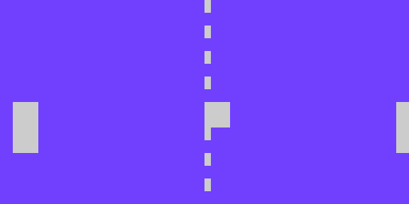
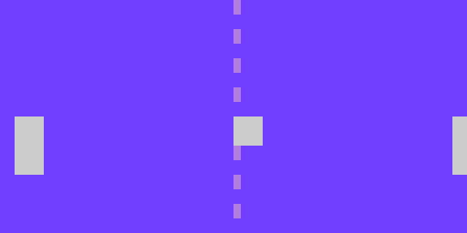

== The Playing Field

I think it's kind of a misnomer that it's called pong, because this game really plays more like an air hockey machine than a ping pong table.

// picture of air hockey machine from above.

But oh, well, history is history, and I guess it's kind of like ping pong, if you were playing in a room the size of the table...

Anyway, in this sectino, we'll add the graphics we need for our game and lay them out on the "field", so we can see what our game will look like.

=== Instructions

Start with LameStation Basic Template as we did in the _SNAKE_ tutorial.

[source]
.HelloPong.spin
----
CON
    _clkmode = xtal1 + pll16x
    _xinfreq = 5_000_000

OBJ
    lcd  : "LameLCD"
    gfx  : "LameGFX"
    ctrl : "LameControl"

PUB Main
    lcd.Start(gfx.Start)
    ctrl.Start
----

This is a pong game, so thing ping pong. What does it need?

// picture of ping pong table would be nice.

- A ball
- Two paddles
- A table
- A score board

==== A Ball

Add the graphics for the ball. I'm using a giant white square because it's very pong-ey, but you can make the ball whatever you want it to be.

[source, language='dat']
.HelloPong.spin
----
PUB Main
    lcd.Start(gfx.Start)
    ctrl.Start
+++
+++DAT
+++
+++    ball_gfx
+++    word    0
+++    word    8, 8
+++    word    %%11111111
+++    word    %%11111111
+++    word    %%11111111
+++    word    %%11111111
+++    word    %%11111111
+++    word    %%11111111
+++    word    %%11111111
+++    word    %%11111111
----

Draw the ball to a nice spot in the center of the screen.

[source]
.HelloPong.spin
----
PUB Main
    lcd.Start(gfx.Start)
    ctrl.Start
+++    
+++    gfx.Sprite (@ball_gfx, 64, 32, 0)
+++    
+++    lcd.Draw

DAT

ball_gfx
----

==== Two Paddles

The paddle graphics are next. Again, a white rectangle is _pretty much_ what the original pong had, so let's just use that.

[source, language='dat']
.HelloPong.spin
----
    word    %%11111111
    word    %%11111111
+++
+++    paddle_gfx
+++    word    0
+++    word    8, 16
+++    word    %%11111111
+++    word    %%11111111
+++    word    %%11111111
+++    word    %%11111111
+++    word    %%11111111
+++    word    %%11111111
+++    word    %%11111111
+++    word    %%11111111
+++    word    %%11111111
+++    word    %%11111111
+++    word    %%11111111
+++    word    %%11111111
+++    word    %%11111111
+++    word    %%11111111
+++    word    %%11111111
+++    word    %%11111111
----

Draw the paddles twice, once on each side of the screen.

[source]
.HelloPong.spin
----
PUB Main
    lcd.Start(gfx.Start)
    ctrl.Start
    
    gfx.Sprite (@ball_gfx, 64, 32, 0)
+++    gfx.Sprite (@paddle_gfx, 4, 32, 0)
+++    gfx.Sprite (@paddle_gfx, 124, 32, 0)
    
    lcd.Draw
----

==== A Table

There really isn't much to draw here. We could make it fancy and add all kinds of crazy table graphics, but for now, let's keep it simple and make a dotted line down the center.

We could create one image for the entire net, but that would be wasteful. Instead, we'll take a single dot and copy it until it makes a line. Here's a dot we can use.

[source, language='dat']
.HelloPong.spin
----
    word    %%11111111
    word    %%11111111
+++
+++    centerline_gfx
+++    word    0
+++    word    2, 4
+++    word    %%11
+++    word    %%11
+++    word    %%11
+++    word    %%11
----

Add a variable `i` for array indexing.

[source, language='obj']
.HelloPong.spin
----
    ctrl : "LameControl"
 
+++VAR
+++    byte    i    

PUB Main
----

We'll draw the dot on the screen 8 times to make a dotted line 64 pixels long. Remember, the ball and paddles sit _on top_ of the table, so the line should be drawn first. 

*It's like painting a picture!*

[source]
.HelloPong.spin
----
PUB Main
    lcd.Start(gfx.Start)
    ctrl.Start

+++    repeat i from 0 to 7
+++        gfx.Sprite (@centerline_gfx, 64, i*8, 0)
    
    gfx.Sprite (@ball_gfx, 64, 32, 0)
    gfx.Sprite (@paddle_gfx, 4, 32, 0)
----

We have a dotted line!

==== The blob

There's one problem: everything is the same color so it just kind of blends together.

The ball and paddles are white, so let's make the net gray.

[source, language='dat']
.HelloPong.spin
----
    centerline_gfx
    word    0
    word    2, 4
***    word    %%33
***    word    %%33
***    word    %%33
***    word    %%33
----

[TIP]
A gray pixel is `%%3` on LameStation.

If we look at it now, it's starting to look pretty slick. Check it out.

==== Finding your center

One _more_ thing to fix: why is everything weirdly off-center?

That's because a sprite's position on the screen is relative to the top-left corner. So if you want to position things correctly on the screen, you have to keep that in mind.

So take this code snippet:

[source, language='pub']
.HelloPong.spin
----
    repeat i from 0 to 7
        gfx.Sprite (@centerline_gfx, 64, i*8, 0)
    
    gfx.Sprite (@ball_gfx, 64, 32, 0)
    gfx.Sprite (@paddle_gfx, 4, 32, 0)
    gfx.Sprite (@paddle_gfx, 124, 32, 0)
    
    lcd.Draw
----

- The center line is 2 pixels wide, so we should subtract 1 to center it.
+
    x = 64 - 1 = 63
    
- The left paddle should be 4 pixels from the edge, so it's fine where it is.
+
    x = 4
    
- The right paddle is falling off the screen! We want its right side 4 pixels from the edge. Since it's 8 pixels wide, we need to subtract 8.
+
    x = 124 - 8 = 116
    
- Both paddles need to start centered. They're 16 pixels high, so we'll subtract half to center them vertically.
+
    y = 32 - 8 = 24
    
- The ball is 8 pixels wide and tall, and belongs in the center of the screen.
+
    x = 64 - 4 = 60
    y = 32 - 4 = 28

[source, language='pub']
.HelloPong.spin
----
    repeat i from 0 to 7
        gfx.Sprite (@centerline_gfx, 63, i*8, 0)
    
    gfx.Sprite (@ball_gfx, 60, 28, 0)
    gfx.Sprite (@paddle_gfx, 4, 24, 0)
    gfx.Sprite (@paddle_gfx, 116, 24, 0)
    
    lcd.Draw
----

[NOTE]
You may have noticed we didn't add the score board. That one's a bit more complicated, so we'll add it in a later section.

=== The Code

[source]
.HelloPong.spin
----
CON
    _clkmode = xtal1 + pll16x
    _xinfreq = 5_000_000
    
OBJ
    lcd  : "LameLCD"
    gfx  : "LameGFX"
    ctrl : "LameControl"
    
VAR
    byte    i

PUB Main
    lcd.Start(gfx.Start)
    ctrl.Start

    repeat i from 0 to 7
        gfx.Sprite (@centerline_gfx, 63, i*8, 0)
    
    gfx.Sprite (@ball_gfx, 60, 28, 0)
    gfx.Sprite (@paddle_gfx, 4, 24, 0)
    gfx.Sprite (@paddle_gfx, 116, 24, 0)
    
    lcd.Draw

DAT

    ball_gfx
    word    0
    word    8, 8
    word    %%11111111
    word    %%11111111
    word    %%11111111
    word    %%11111111
    word    %%11111111
    word    %%11111111
    word    %%11111111
    word    %%11111111
    
    paddle_gfx
    word    0
    word    8, 16
    word    %%11111111
    word    %%11111111
    word    %%11111111
    word    %%11111111
    word    %%11111111
    word    %%11111111
    word    %%11111111
    word    %%11111111
    word    %%11111111
    word    %%11111111
    word    %%11111111
    word    %%11111111
    word    %%11111111
    word    %%11111111
    word    %%11111111
    word    %%11111111
    
    centerline_gfx
    word    0
    word    2, 4
    word    %%33
    word    %%33
    word    %%33
    word    %%33
----

=== Feeling Adventurous?

1. We decided to keep the playing field fairly simple this time around, but what if we wanted to make it nicer? Try spicing up the playing field: make it like a hockey rink or something more than a dotted line!
